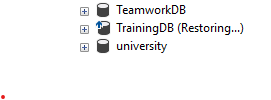

## Exploring SQL Server Backup Types

### 1. Research Task
**Search for and summarize the following backup types:**

1. Full Backup 
2. Differential Backup 
3. Transaction Log Backup 
4. Copy-Only Backup 
5. File/Filegroup Backup

 ---------------

 **1.Full Backup:**

 When Applied:  as a basic backup; usually planned on a daily or weekly basis.

 In order to maintain consistency, the entire database is included, along with a portion of the transaction log.

 **Pros:**

 - straightforward restoration procedure.

 - full database snapshot.

 **Cons:**

 - big in dimensions.

 - time-consuming.

 **Real-World Scenario: To protect all customer transaction data, a banking system performs a complete backup every Sunday night.**

 -------------

 **2.Differential Backup:**

 Used Every day in between complete backups.

 Changes since the last complete backup are among its contents.

  **Pros:**

 - quicker and smaller than complete backups.

 - effective storage utilization.

 **Cons:**

 - needs the most recent complete backup in order to recover.

 **Real-World Scenario: Following the first weekly complete backup, an e-learning platform backs up student progress and course content updates every night.**

 ----------------

 **3. Transaction Log Backup**

 When Used: Regular backups in FULL recovery mode (e.g., every 15 to 60 minutes).

 All transaction logs since the last log backup are included.

**Pros:**

 - Point-in-time recovery is made possible.

 - reduces the loss of data.

 **Cons:**

 - If the recovery model is SIMPLE, it cannot be used.

 - Regular upkeep is necessary.

 **A ticketing system that records each booking and transaction almost instantly is an example of a real-world scenario.**

 -----------------------

 **4.Copy-Only Backup** 
 
 Ad hoc backups that don't interfere with the backup sequence are known as copy-only backups.

 It contains the entire database or transaction log, just like a complete backup, but it doesn't affect the differential base.

 **Pros:**

 - has no effect on the backup chain.

 - secure for backups whenever needed.

 **Cons:**

 - Not suitable as a foundation for log or differential backups.

 **Real-World Scenario: Make a backup before implementing a significant update to the hospital management system.**

 ---------------

 **5.File/Filegroup Backup**
 
 Use of File/Filegroup Backup: Big databases with several filegroups.

 It contains certain files or filegroups.

 **Pros:**

 - permits partial restores and backups.

 - beneficial for VLDBs.

 **Cons:**

 - difficult to handle.

 - calls for thorough recovery procedures.

 **A university database with distinct filegroups for departments and faculties is an example of a real-world scenario.**

 -------------
 ## Follow-Up Task: Restore the Database from Your Backup Files
 #### Step 1: Drop the Current Database (Simulate System Failure)
 ```sql
DROP DATABASE TrainingDB;

```
##### Step 2: Restore from Your Backups Use the same file names and paths you used earlier. Replace them accordingly.

#### 1. Restore FULL backup
 ```sql
RESTORE DATABASE TrainingDB  
FROM DISK = 'C:\Program Files\Microsoft SQL Server\MSSQL16.MSSQLSERVER\MSSQL\Backup\TrainingDB_Full.bak' 
WITH NORECOVERY; 
```


#### 2. Restore DIFFERENTIAL backup (if you created one)
```sql
RESTORE DATABASE TrainingDB  
FROM DISK = 'C:\Program Files\Microsoft SQL Server\MSSQL16.MSSQLSERVER\MSSQL\Backup\TrainingDB_Diff.bak' 
WITH NORECOVERY; 
```
#### 3. Restore TRANSACTION LOG backup (if you created one)
```sql
RESTORE LOG TrainingDB  
FROM DISK = 'C:\Program Files\Microsoft SQL Server\MSSQL16.MSSQLSERVER\MSSQL\Backup\TrainingDB_Log.trn' 
WITH RECOVERY; 
    
```
#### Step 3: Verify the Restored Data
```sql

USE TrainingDB; 
SELECT * FROM Students; 
```


-------------------

### Reflection Questions: 
#### 1. What would happen if you skipped the differential backup step? 
Only data up to the complete backup would be recoverable.  Unless reapplied in another way, any changes recorded by the differential backup would be lost.

#### 2. What’s the difference between restoring a full vs. copy-only backup? 
- Differential/log backups are built on top of Full Backup.

- Copy-Only Backup cannot be used as a foundation for differential or log backups and has no effect on the backup chain.

#### 3. What happens if you use WITH RECOVERY in the middle of a restore chain?
It stops applying additional backups (such as diff or log) and terminates the restoration process. After that, you would have to start over from the complete backup.